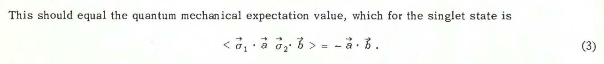
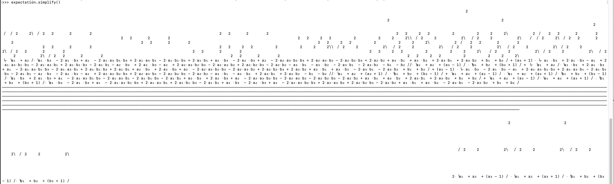

= Learning Quantum Mechanics The Hard Way
Siddharth Jain <siddjain@live.com>
:revdate: 2021-06-22 10:30:00 -0800
:doctype: article
:stem: latexmath
:eqnums: all
:xrefstyle: short

John S. Bell in this landmark paper https://cds.cern.ch/record/111654/files/vol1p195-200_001.pdf[On The EPR Paradox] considered the EPR experiment with a modification -
Alice and Bob's detectors are no longer oriented along the same axis. Alice detector is oriented along stem:[\vec{a}] and Bob's detector is oriented along stem:[\vec{b}]. 

**Question: What is the expected value of Alice's spin stem:[\times] Bob's spin?**

Bell solves it in one line:

and that is why he is Bell. But we will solve it the hard way using the `sympy` package in Python. Let's get started. I won't be showing the full code but bits and pieces of it. First, create the vector corresponding to the spin-singlet state i.e., stem:[\frac{1}{\sqrt{2}}(|01\rangle - |10\rangle)]:

[source,python]
----
psi = 1 / sympy.sqrt(2) * Matrix([[0],[1],[-1],[0]])
----

Next, create the stem:[2 \times 2] matrices corresponding to Alice and Bob. The matrices are identical except for the axes they use:

[source,python]
----
a1, a2, a3, b1, b2, b3 = sympy.symbols('a1 a2 a3 b1 b2 b3', real=True)
M_A = a1 * X + a2 * Y + a3 * Z
M_B = b1 * X + b2 * Y + b3 * Z 
----

where `X, Y, Z` are the Pauli matrices. Now notice that `psi` is a stem:[4 \times 1] vector but the matrices above are stem:[2 \times 2]. The stem:[4 \times 4] matrix corresponding to Alice's observable is given by stem:[I \otimes M_A] and conversely the stem:[4 \times 4] matrix corresponding to Bob's observable is given by stem:[M_B \otimes I] where stem:[I] of course is the identity matrix.

We can calculate these matrices using the `TensorProduct` function (it takes arguments in "`opposite`" order):

[source,python]
----
Alice = TensorProduct(M_A, eye(2))
Bob   = TensorProduct(eye(2), M_B)
----

Now we write a function which will simulate Alice making a measurement on her qubit:

[source,python]
----
alice_measurements, alice_probabilities, psis = measure(psi, Alice)
----

Writing the `measure` function is left as exercise and is the heart of the code. The `measure` function takes input the wavefunction `psi` and an observable (given by `Alice` in above).
Remember an observable is a Hermitian matrix. The function returns us 3 things:

* an array of possible measurement outcomes. This is computed by computing the _distinct_ eigenvalues of the input observable. In our case we will get only two distinct eigenvalues: stem:[+1] and stem:[-1].
* an array of the respective probabilities of the outcomes.
* an array containing the collapsed wavefunction in each case.

Next, we need to simulate Bob's measurement for each possible outcome of Alice's measurement (so we have a nested loop):

[source,python]
----
for i in range(0, len(alice_measurements)):
    alice_spin = alice_measurements[i]
    alice_prob = alice_probabilities[i]
    psi = psis[i]
    bob_measurements, bob_probabilities, bob_psis = measure(psi, Bob)
    for j in range(0, len(bob_measurements)):
        bob_spin = bob_measurements[j]
        bob_prob = bob_probabilities[j]
        spin_product.append(alice_spin * bob_spin)
        probabilities.append(alice_prob * bob_prob)
----

The final answer i.e., expected value of Alice's spin stem:[\times] Bob's spin is given by:

[source,python]
----
for i in range(0, len(spin_product)):
    expectation += spin_product[i] * probabilities[i]

sympy.pprint(expectation)
----

Running this does not give the simple stem:[\vec{a} \cdot \vec{b}]. Instead I get a monstrous expression. I tried simplifying it using the `simplify` function but it didn't help.

To check I didn't have a bug in my code, I evaluated the expression (i.e., compute a numerical value) using the `n()` or `N` function in `sympy` and that did give correct result.

